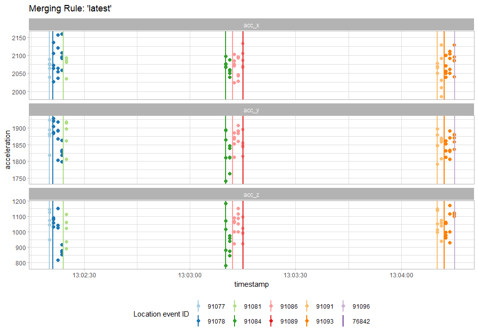

# Fetch and Merge Accelerometer data to Locations

MoveApps

Github repository:
<https://github.com/dmpstats/Fetch_and_Bind_Acceleration_to_Locations>

## Description

Downloads available accelerometer data for individuals and time window
comprised in the input location data and merges acceleration
measurements to each observed location based on recorded time.

## Documentation

Given the individuals and time-span of recorded events in the input
location data, this App is tasked with downloading and merging available
(non-location) acceleration data to recorded locations. Merging is
entirely time-based, and the underlying data processing can be outlined
as follows:

1.  Extract animal/track IDs and start-end timestamps of location events
    for individuals present in input data;

2.  Check user’s download permissions and availability of accelerometer
    (ACC) data for each individual;

3.  Download sought ACC data via `move2::download_study_data()`;

4.  Process ACC data into a standardized format. ACC samples can be
    recorded in Movebank in plain format (one ACC measurement on each
    active axis per row) or nested format (burst of consecutive AAC
    values stored per row). In this step:

    - Downloaded data is reshaped to return bursts of ACC values nested
      in a list-column named `acc_bursts`. Therefore, each row of
      standardized ACC represents an event at which a burst of ACC
      values (per active axis) was recorded, with the timestamp column
      specifying the starting time of the burst.

    - The type (raw or non-raw) and tag origin (eobs or non-eobs) of ACC
      samples are also added as data attributes.

    - ACC data can optionally be thinned down to only retain a single
      ACC burst event within a given time interval via the parameter
      `acc_timefilter` (details in the Settings section below). This
      feature can be useful to avoid long computations, and potentially
      lack of memory issues, when processing high-frequency ACC data
      (e.g. 1 burst every couple of seconds).

5.  Merge processed ACC events to location events of the same
    animal/track based on recording timestamps and according to a choice
    between two merging criteria:

    - `'latest'`: ACC events are allocated to the latest location event
      preceding the starting time at which ACC bursts were recorded

    - `'nearest'`: ACC events are allocated to the closest-in-time
      location event, which can occur either before or after the ACC
      sampling starting time.

    ACC events are joined to corresponding location events in a
    list-column named `acc_dt`. Data nesting is required here as,
    depending on the frequency of ACC events relative to location
    events, consecutive ACC events may be allocated to the same location
    event.

6.  Prepare merged data for output, where `output` is a `move2` location
    object containing the entire input data along with the following
    additions:

    - *event data*: the list-column `acc_dt` comprising the downloaded
      and merged ACC events

    - *track data*: columns `acc_dwn_start_time`, `acc_dwn_end_time` and
      `acc_in_timespan` providing information about the ACC downloading
      step.

    - *object attributes*:

      - `acc_merging_rule` specifying the selected merging rule[^1]
      - `acc_track_data` providing the track data component of the
        merged ACC data

<br />

<div>

> **Note**
>
> The creation of this App was prompted by a current limitation in
> MoveApps, which allows Workflows to be initiated from either location
> or non-location data but not both simultaneously. MoveApps has plans
> to ease this restriction in the future, such as enabling multiple data
> inputs on Apps. Consequently, it is possible that this App may become
> obsolete in the future.

</div>

<br />

### Input data

`move2` location object

### Output data

`move2` location object - see point 6. of
[Documentation](#sec-documentation) for additional context. Section
[Using the Output data](#sec-demo) demonstrates how to access and
manipulate the merged data in the output object.

### Artefacts

`downloaded_acc_data.rds`: a `tibble` object with downloaded and
processed ACC data, with ACC events and track data nested by animal in,
respectively, list-columns `acc_dt` and `acc_trk_dt`.

### Parameters

**Movebank username** (`usr`): character string, the Movebank username.
Default: `NULL`.

**Movebank password** (`pwd`): character string, the Movebank password.
Default: `NULL`.

**Merging Rule** (`merging_rule`): specify how downloaded Accelerometer
data is merged to location data. ACC events can allocated to either:

- the latest recorded location available preceding sampling time
  (`'latest'`, the default), or
- the closest-in-time recorded location (`'nearest'`)

**Store ACC track information** (`store_acc_track_info`): check-box to
choose whether to store track data from merged ACC data as an attribute
of the output `move2` object. Default: `FALSE`.

**Filter downloaded ACC data by time interval** (`acc_timefilter`): an
integer defining the time interval, in minutes, for thinning the ACC
data. Must be between 0 (no filtering) and 30. Unit: `minutes`; default:
`0`

### Most common errors

None yet

### Null or error handling

**data**: the App will skip the merging step and return a modified
version of the input data with an empty column `acc_dt` if:

- Accelerometer data is not collected for any of the animals in the
  input data,
- the user does not have downloading permission for the study

An informative warning is also issued.

**Movebank username** (`usr`) and **Movebank password** (`pwd`): If one
of the credentials are either NULL or connection to Movebank is voided
due to invalid log-in details, the app will return an error reminding
the user to provide valid credentials.

**Filter downloaded ACC data by time interval** (`acc_timefilter`): The
App will throw an error if the specified interval is not between 0 and
30.

### Using the output data

The purpose of this App is to retrieve and combine available
non-location Accelerometer (ACC) data with the provided input location
data. The format of the returned output data is structured with data
nesting, providing a versatile approach for handling the merged
information in subsequent applications. The trade-off for this
flexibility is the slightly increased level of data manipulation needed
to work with nested datasets.

Here we suggest some sample code to inspect, manipulate and apply the
output data effectively in e.g. downstream Apps within a MoveApps
Workflow. Let’s start by loading the dependencies required to run this
demonstration.

``` r
# load dependencies
library(move2)
library(dplyr)
library(tidyr)
library(purrr)
library(ggplot2)
library(stringr)
library(gganimate)

source("RFunction.R")
source(file.path("src/common/logger.R"))
source(file.path("src/io/app_files.R"))
source(file.path("src/io/io_handler.R"))
```

Now we run the App’s underpinning `rFunction` for a given input `data`
using the `'lates'` merging rule.

``` r
output <- rFunction(data, usr = usr, pwd = pwd, merging_rule = 'latest') 
```

    [INFO: 2023-10-23 15:26:56] Collecting details about input data
    [INFO: 2023-10-23 15:26:56] Checking ACC data availability
    [INFO: 2023-10-23 15:26:56] Downloading ACC data for each animal
    [INFO: 2023-10-23 15:27:02] 

    ====== Summary of downloaded ACC data =======

    # A tibble: 1 × 9
        study_id individual_local_identifier sensor_type_ids  is_acc_collected
         <int64> <fct>                       <chr>            <lgl>           
    1 1941203363 Bateleur_8887               acceleration,gps TRUE            
      i_have_download_access acc_dwn_start_time  acc_dwn_end_time    acc_in_timespan
      <lgl>                  <dttm>              <dttm>              <lgl>          
    1 TRUE                   2023-09-10 08:15:23 2023-09-11 09:00:26 TRUE           
      acc_nrows
          <int>
    1       174

    [INFO: 2023-10-23 15:27:02] Processing downloaded Accelerometer data
    [INFO: 2023-10-23 15:27:02] Merging ACC data to location data
    [INFO: 2023-10-23 15:27:02] Preparing data for output

    Joining with `by = join_by(individual_id, sensor_type_ids,
    individual_local_identifier, study_id, i_have_download_access)`

    [INFO: 2023-10-23 15:27:02] Done! App has finished all its tasks

The output data is a `move2` location object, where the merged
Accelerometer (ACC) data is provided as `tibble` objects nested in
list-column `acc_dt`.

``` r
output <- output |> 
  dplyr::select(where(~all(!is.na(.)))) # dropping redundant columns

output
```

    A <move2> object containing 1 track consisting of:
    Simple feature collection with 10 features and 9 fields
    Geometry type: POINT
    Dimension:     XY
    Bounding box:  xmin: 38.51449 ymin: -11.17893 xmax: 39.00675 ymax: -11.01733
    Geodetic CRS:  WGS 84
    # A tibble: 10 × 10
       sensor_type_id individual_local_identifier eobs_battery_voltage
              <int64> <fct>                                       [mV]
     1            653 Bateleur_8887                               4001
     2            653 Bateleur_8887                               4001
     3            653 Bateleur_8887                               4001
     4            653 Bateleur_8887                               4001
     5            653 Bateleur_8887                               4001
     6            653 Bateleur_8887                               4000
     7            653 Bateleur_8887                               4000
     8            653 Bateleur_8887                               4000
     9            653 Bateleur_8887                               4000
    10            653 Bateleur_8887                               4000
       eobs_key_bin_checksum import_marked_outlier timestamp              event_id
                     <int64> <lgl>                 <dttm>                  <int64>
     1                     0 FALSE                 2023-09-10 08:15:23 29702280943
     2                     0 FALSE                 2023-09-10 08:30:09 29702280944
     3                     0 FALSE                 2023-09-10 08:45:09 29702280945
     4                     0 FALSE                 2023-09-10 09:00:09 29702280946
     5                     0 FALSE                 2023-09-10 09:00:27 29702280947
     6                     0 FALSE                 2023-09-11 08:15:20 29708533560
     7                     0 FALSE                 2023-09-11 08:30:09 29708533561
     8                     0 FALSE                 2023-09-11 08:45:09 29708533562
     9                     0 FALSE                 2023-09-11 09:00:09 29708533563
    10                     0 FALSE                 2023-09-11 09:00:26 29708533564
       visible             geometry acc_dt             
       <lgl>            <POINT [°]> <list>             
     1 TRUE    (38.51566 -11.03651) <tibble [3 × 14]>  
     2 TRUE    (38.51449 -11.04464) <tibble [3 × 14]>  
     3 TRUE     (38.55216 -11.0261) <tibble [3 × 14]>  
     4 TRUE    (38.58648 -11.01733) <tibble [1 × 14]>  
     5 TRUE    (38.58923 -11.01751) <tibble [154 × 14]>
     6 TRUE    (38.95603 -11.17893) <tibble [3 × 14]>  
     7 TRUE      (38.9936 -11.1532) <tibble [3 × 14]>  
     8 TRUE    (39.00675 -11.12555) <tibble [3 × 14]>  
     9 TRUE    (39.00009 -11.10859) <tibble [1 × 14]>  
    10 TRUE     (39.0001 -11.10937) <NULL>             
    Track features:
    # A tibble: 1 × 53
      deployment_id     tag_id individual_id deploy_on_person deploy_on_timestamp
            <int64>    <int64>       <int64> <chr>            <dttm>             
    1    2145556232 1941951358    1941205813 Andre Botha      2022-06-04 00:00:00
      sensor_type_ids  capture_location deploy_on_location deploy_off_location
      <chr>                 <POINT [°]>        <POINT [°]>         <POINT [°]>
    1 acceleration,gps            EMPTY              EMPTY               EMPTY
      individual_comments latest_date_born    individual_local_identifier
      <chr>               <dttm>              <fct>                      
    1 2-3 years old       2019-04-01 00:00:00 Bateleur_8887              
      nick_name     ring_id sex   taxon_canonical_name 
      <fct>         <fct>   <fct> <fct>                
    1 Bateleur_8887 9-16864 f     Terathopius ecaudatus
      individual_number_of_deployments taxon_detail mortality_location
                                 <int> <fct>               <POINT [°]>
    1                                1 <NA>                      EMPTY
      tag_local_identifier tag_number_of_deploy…¹ study_id acknowledgements citation
      <fct>                                 <int>  <int64> <chr>            <chr>   
    1 8887                                      2     1.e9 Vultures for Af… Vulture…
      grants_used      has_quota i_am_owner is_test license_terms license_type name 
      <chr>            <lgl>     <lgl>      <lgl>   <chr>         <fct>        <fct>
    1 Vultures for Af… TRUE      FALSE      FALSE   The person w… CC_0         Sout…
    # ℹ abbreviated name: ¹​tag_number_of_deployments
    # ℹ 22 more variables: study_number_of_deployments <int>, number_of_individuals [count], number_of_tags [count], principal_investigator_name <chr>, study_objective <chr>, study_type <fct>, suspend_license_terms <lgl>, i_can_see_data <lgl>, there_are_data_which_i_cannot_see <lgl>, i_have_download_access <lgl>, i_am_collaborator <lgl>, study_permission <fct>, timestamp_first_deployed_location <dttm>, timestamp_last_deployed_location <dttm>, number_of_deployed_locations [count], taxon_ids <chr>,
    #   contact_person_name <fct>, main_location <POINT [°]>, is_acc_collected <lgl>, acc_dwn_start_time <dttm>, acc_dwn_end_time <dttm>, acc_in_timespan <lgl>

#### Accessing nested ACC data

ACC events recorded e.g. between the second and third location points
can retrieved by

``` r
output |> 
  as_tibble() |> 
  slice(2) |> 
  dplyr::select(acc_dt) |> 
  unnest(acc_dt)
```

    # A tibble: 3 × 14
      sensor_type_id individual_local_identifier data_decoding_software
             <int64> <fct>                       <fct>                 
    1        2365683 Bateleur_8887               16                    
    2        2365683 Bateleur_8887               16                    
    3        2365683 Bateleur_8887               16                    
      eobs_acceleration_sampling_frequency_per_axis eobs_key_bin_checksum
                                               [Hz]               <int64>
    1                                          33.3            3757502306
    2                                          33.3            3340072916
    3                                          33.3            3183081267
      eobs_start_timestamp import_marked_outlier timestamp              event_id
      <dttm>               <lgl>                 <dttm>                  <int64>
    1 2023-09-10 08:30:10  FALSE                 2023-09-10 08:30:10 29979003285
    2 2023-09-10 08:35:00  FALSE                 2023-09-10 08:35:00 29979003286
    3 2023-09-10 08:40:00  FALSE                 2023-09-10 08:40:00 29979003287
      visible    geometry acc_burst       is_acc_raw is_acc_eobs
      <lgl>   <POINT [°]> <list>          <lgl>      <lgl>      
    1 TRUE          EMPTY <dbl [264 × 3]> TRUE       TRUE       
    2 TRUE          EMPTY <dbl [264 × 3]> TRUE       TRUE       
    3 TRUE          EMPTY <dbl [264 × 3]> TRUE       TRUE       

Acceleration measurements recorded in each ACC event are nested in
list-column `acc_burst`. Thus, the burst of ACC values in each active
axis sampled in the first ACC event between the second and third
location points is accessible via

``` r
output |> 
  as_tibble() |> 
  slice(2) |> 
  dplyr::select(acc_dt) |> 
  unnest(acc_dt) |> 
  slice(1) |> 
  mutate(acc_burst = map(acc_burst, as_tibble)) |> # required for nicer unnesting compared to the original matrix format
  dplyr::select(acc_burst)|> 
  unnest(acc_burst)
```

    # A tibble: 264 × 3
       acc_x acc_y acc_z
       <dbl> <dbl> <dbl>
     1  1964  1757  1635
     2  1963  1760  1631
     3  1966  1759  1630
     4  1968  1760  1630
     5  1971  1761  1630
     6  1973  1760  1628
     7  1979  1760  1631
     8  1980  1755  1628
     9  1980  1759  1628
    10  1982  1761  1627
    # ℹ 254 more rows

#### `'latest'` versus `'nearest'` merging

[Figure 1](#fig-merging-rule) provide a graphical representation of the
difference between the two available options for merging the ACC data to
location data (via parameter `merging_rule`).

<details>
<summary>Code</summary>

``` r
output_merg_unpacked <- output_merg |>
  as_tibble() |>
  mutate(acc_dt = map(acc_dt, \(acc_events){
    if(!is.null(acc_events)){
      acc_events |>
        mutate(
          acc_burst = pmap(
            list(eobs_acceleration_sampling_frequency_per_axis, timestamp, acc_burst),
            \(freq, start_time, acc){
              # downsize to only first 5 measurements on each acc event, for plotting clarity
              n <- 5
              acc |>
                as_tibble() |>
                slice(floor(seq(1, nrow(acc), length.out = n))) |>
                mutate(
                  acc_timestamp = start_time,
                  #acc_timestamp = seq.POSIXt(from = start_time, by = 1/freq, length.out = n),
                  .before = 1
                )
            })
        ) |>
        unnest(acc_burst) |>
        rename(acc_event_id = event_id) |>
        dplyr::select(acc_event_id, acc_timestamp, matches("acc_[xyz]"))
    } else NULL
  })) |>
  unnest(acc_dt)


location_times <- output_merg |> 
  ungroup() |> 
  distinct(event_id, geometry, timestamp)

p <- output_merg_unpacked |>
  pivot_longer(cols = c(acc_x, acc_y, acc_z), names_to = "acc_axis", values_to = "acc_value") |>
  ggplot() +
  geom_point(aes(x = acc_timestamp, y = acc_value, col = factor(event_id), group = merging), size = 2) +
  facet_wrap(~acc_axis, ncol = 1, scales = "free_y") +
  geom_vline(aes(xintercept = timestamp, col = factor(event_id)), data = location_times, linewidth = 1) +
  labs(title = "merging_rule: 'latest'", y = "acceleration", x = "timestamp",
       col = "Location event ID") +
  scale_color_brewer(type = "qual", palette = "Paired") +
  theme_light() +
  theme(legend.position = "bottom")


p + 
  transition_states(merging, transition_length = 1, state_length = 3) +
  ggtitle("Merging Rule: '{closest_state}'") +
  enter_fade() + 
  exit_shrink() +
  ease_aes('sine-in-out')
```

</details>

<figure>

<figcaption aria-hidden="true">Figure 1: Comparing the
<code>'latest'</code> and <code>'nearest'</code> rules for merging ACC
data with location data. Vertical lines mark the timestamps of six
location events, while points represent acceleration values sampled in
ACC events. Points are colored according to their assigned location
given the selected merging rule.</figcaption>
</figure>

#### Summarising ACC measurements relative to location events

Summarizing acceleration values between consecutive location points may
be required in downstream applications such as animal behavior
classifiers.

For instance, the variance of all acceleration values recorded between
each location event (per active ACC axis) can be computed as follows.

``` r
loc_acc_var <- output |> 
  mutate(
    var = map(acc_dt, \(acc_events){
      if(!is.null(acc_events$acc_burst)){
        # bind list of matrices (one per ACC event) by row
        all_bursts <- do.call(rbind, acc_events$acc_burst)
        # variance in each active ACC axis
        apply(all_bursts, 2, var)  
      } else{
        NULL
      }
    })
  ) |> 
  unnest_wider(var, names_sep = "_")

loc_acc_var
```

    # A tibble: 10 × 13
       sensor_type_id individual_local_identifier eobs_battery_voltage
              <int64> <fct>                                       [mV]
     1            653 Bateleur_8887                               4001
     2            653 Bateleur_8887                               4001
     3            653 Bateleur_8887                               4001
     4            653 Bateleur_8887                               4001
     5            653 Bateleur_8887                               4001
     6            653 Bateleur_8887                               4000
     7            653 Bateleur_8887                               4000
     8            653 Bateleur_8887                               4000
     9            653 Bateleur_8887                               4000
    10            653 Bateleur_8887                               4000
       eobs_key_bin_checksum import_marked_outlier timestamp              event_id
                     <int64> <lgl>                 <dttm>                  <int64>
     1                     0 FALSE                 2023-09-10 08:15:23 29702280943
     2                     0 FALSE                 2023-09-10 08:30:09 29702280944
     3                     0 FALSE                 2023-09-10 08:45:09 29702280945
     4                     0 FALSE                 2023-09-10 09:00:09 29702280946
     5                     0 FALSE                 2023-09-10 09:00:27 29702280947
     6                     0 FALSE                 2023-09-11 08:15:20 29708533560
     7                     0 FALSE                 2023-09-11 08:30:09 29708533561
     8                     0 FALSE                 2023-09-11 08:45:09 29708533562
     9                     0 FALSE                 2023-09-11 09:00:09 29708533563
    10                     0 FALSE                 2023-09-11 09:00:26 29708533564
       visible             geometry acc_dt              var_acc_x var_acc_y
       <lgl>            <POINT [°]> <list>                  <dbl>     <dbl>
     1 TRUE    (38.51566 -11.03651) <tibble [3 × 14]>       2220.    19814.
     2 TRUE    (38.51449 -11.04464) <tibble [3 × 14]>       3326.    21660.
     3 TRUE     (38.55216 -11.0261) <tibble [3 × 14]>       3106.     1064.
     4 TRUE    (38.58648 -11.01733) <tibble [1 × 14]>       4971.     1171.
     5 TRUE    (38.58923 -11.01751) <tibble [154 × 14]>     6685.    31046.
     6 TRUE    (38.95603 -11.17893) <tibble [3 × 14]>       1336.      683.
     7 TRUE      (38.9936 -11.1532) <tibble [3 × 14]>       1806.     1226.
     8 TRUE    (39.00675 -11.12555) <tibble [3 × 14]>       2759.    24296.
     9 TRUE    (39.00009 -11.10859) <tibble [1 × 14]>        944.      580.
    10 TRUE     (39.0001 -11.10937) <NULL>                    NA        NA 
       var_acc_z
           <dbl>
     1     5253.
     2     7802.
     3    11439.
     4    26670.
     5    17294.
     6     5074.
     7     6234.
     8    12359.
     9     2859.
    10       NA 

Note that `loc_acc_var` is not a `move2` object anymore. This is a
by-product of the un-nesting process, which drops the `move2` and `sf`
classes and their attributes. However, back-conversion is
straightforward using `{move2}` functionality and the original `output`
object, as e.g.

``` r
loc_acc_var <- loc_acc_var |> 
  mt_as_move2(
    time_column = mt_time_column(output), 
    track_id_column = mt_track_id_column(output)
)

mt_is_move2(loc_acc_var)
```

    [1] TRUE

[^1]: retrievable via `attr(output, "acc_merging_rule")`
